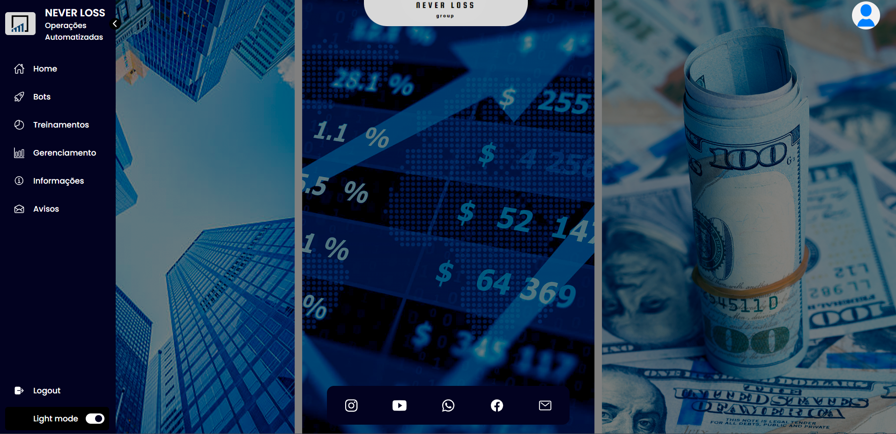

# Plataforma de Operações no Mercado Financeiro


Este projeto foi desenvolvido para os usuários operarem no mercado financeiro com uma experiência melhor e com conexão à corretora DERIV, utilizando nossos bots de operações. Este projeto consome um socket da [deriv.com](https://deriv.com) para efetuar as operações e controlar ganhos e perdas via gerenciamento dentro da plataforma.

## Tecnologias Utilizadas

- [Express](https://expressjs.com) -  framework para Node.js que fornece recursos mínimos para construção de servidores web.
- [Node.js](https://nodejs.org) - Ambiente de execução JavaScript do lado do servidor.
- [Sequelize.js](https://sequelize.org) - ORM para criar modelos (classes) em JavaScript que representam as tabelas do banco de dados.
- [Passport.js](https://www.passportjs.org) - Middleware de autenticação para o Node.js
- [Microsoft SQL Server](https://www.microsoft.com/pt-br/sql-server) - Foi utilizado como banco de dados o Relacional SQL Server.

## Como Executar

1. Clone o repositório e acesse a pasta do projeto
   ```shell
   git clone https://github.com/LinsDeveloper/NLprod.git
    ```
2. Instale os pacotes utilizando o comando `npm install`
3. Crie um arquivo `.env` na raiz do projeto e insira suas credencias. Utilize o arquivo `.env.example` como base.
4. Execute o projeto com o comando `npm start`


## Imagens

Este projeto serviu como base para efetuar o deploy na plataforma de Cloud [HEROKU](https://www.heroku.com/pricing) e entregar a melhor experiência aos usuários com uma aplicação Full Stack. 

Algumas imagens da plataforma:

Login:


Home:


Gerenciamento:


Gerenciamento:


## License

Esse projeto está licenciado pelo [MIT License](https://github.com/LinsDeveloper/NLprod/blob/main/LICENSE).